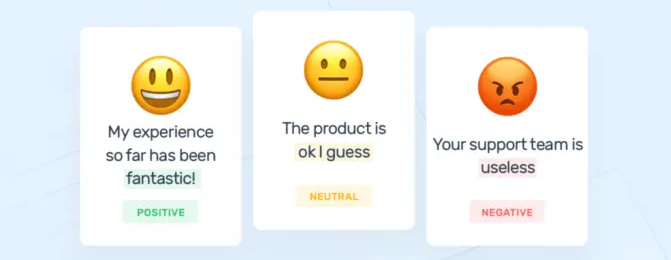
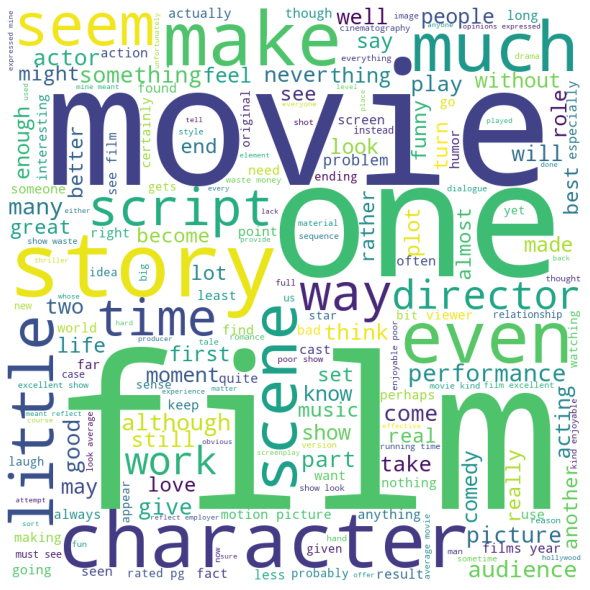
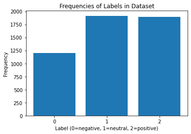
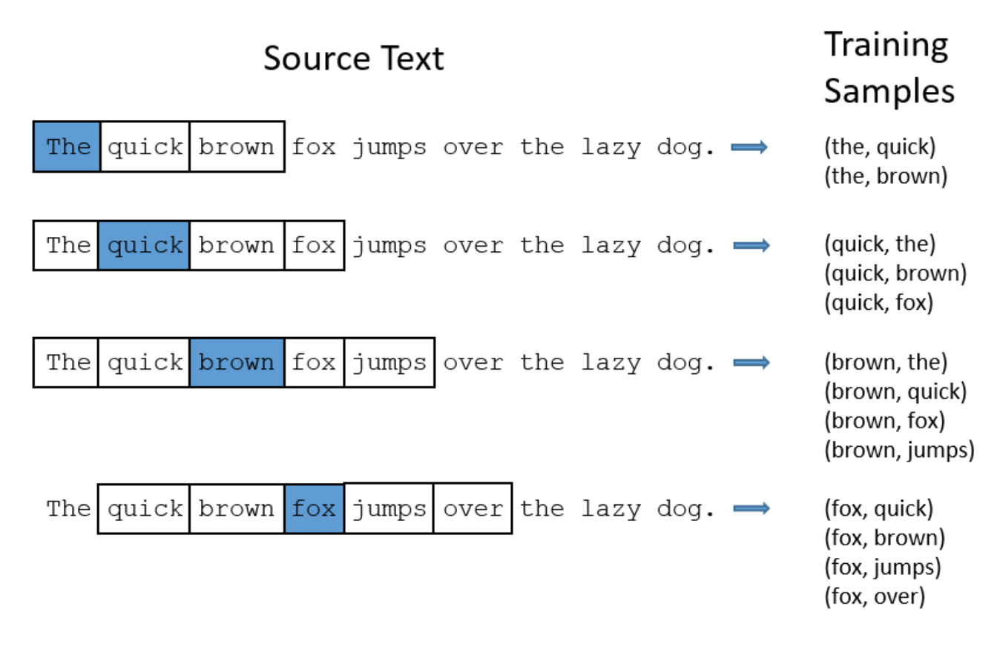
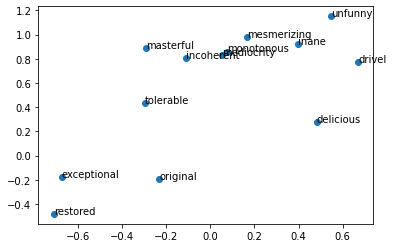
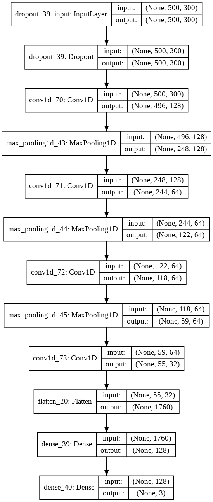
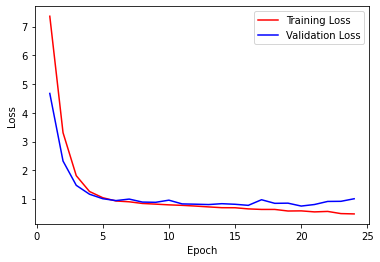
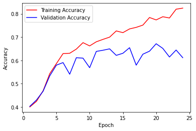

### Introduction

#### What is Sentiment Analysis?

Sentiment analysis is the application of natural language processing (NLP) to learn and determine the emotion or feeling associated with a statement. This feeling can be categorized as positive, neutral or negative; sad, angry, or happy; as a rating from 1 to 10; etc.

Source: <a href="https://monkeylearn.com/sentiment-analysis/">MonkeyLearn</a>

In the literature, the task of sentiment analysis is most commonly performed on online reviews written by consumers because this data is widely available and lends itself well to the task, given that reviews are usually accompanied with numerical ratings.

The sentiment analysis task is an important and widely used application of machine learning, since it allows businesses to automatically identify customer sentiment towards their brands, products and sentiments. Improving the accuracy of sentiment analysis models could result in significant commercial benefits for businesses, which is why we chose to investigate this task.

#### Our Goal

Our team will perform supervised learning with a convolutional neural network model to perform sentiment analysis on movie reviews. The corpus consists of reviews previously collected into a commonly studied dataset [6].

Our goal is train a model that can predict the correct sentiment labels (negative/neutral/positive) for previously unseen movie reviews with an accuracy of at least 70%, which approaches the results found in existing literature (mid 70% range with classical ML methods such as SVMs [3], above 80% with deep learning [2]). Given that the accuracy at random for a 3-class classifier would be 33%, we believe our goal of 70% is a non-trivial but realistic target.

#### Why Convolutional Neural Networks?

CNNs are neural networks that use convolutional layers, where each layer essentially applies a sliding window kernel to the input data. While they are often used in computer vision on images to capture local spatial information, they can be used in NLP as well, on documents with word embeddings. Such applications of CNNs have been found to perform quite well in extracting useful information such as relationships between words [2][4].

Source: <a href="https://towardsdatascience.com/a-comprehensive-guide-to-convolutional-neural-networks-the-eli5-way-3bd2b1164a53">Sumit Saha</a>

We believe that by using a CNN architecture similar to those used for computer vision architectures, we can build an effective sentiment analysis model capable of at least partly capturing the contexual meaning of words. Intuitively, we expect that this approach should outperform simpler bag-of-words techniques, but may not measure up to recursive deep models [2].

### Dataset and Pre-Processing

For our movie review data, we used "Scale Dataset v1.0" by Bo Pang et al [6]. This dataset has been commonly studied in the literature for the task of sentiment analysis [7], which is why we found it appropriate for our investigation.

The dataset contains 5006 total examples, in the form of a tokenized plaintext movie review and an associated label for each example. We have used the 3-class labels provided in the dataset, which are interpreted as 0 (negative), 1 (neutral) and 2 (positive).

Below are several randomly selected quotes from the movie reviews in the dataset, to demonstrate the nature of the data:

- `hollywood adaptations of plays rarely come off much worse than this b&w one did . there is no kind way to put it otherwise , or to say if only it did this or that the film could have been saved , nor is there reason to say , if the acting was better the film could have been bearable .`
- `wonderland is a rather sugary romance film that is as subtle as a ton of bricks falling on you . you can see its plot developing from a mile away .`
- `director paul verhoeven , whose previous works include movies as diverse as robocop and basic instinct , takes an especially imaginative and fresh approach to science fiction with his new film starship troopers .`

TODO: Visualization, word cloud of the dataset

Word cloud of our dataset

The following bar graph illustrates how the entire dataset is distributed over the possible output labels (negative/neutral/positive). As shown, there are relatively fewer negative examples, so it is worth noting that our results may be affected by a minor class imbalance inherent in the dataset.

Distribution of labels in our dataset

TODO: What pre-processing we perform, what is word2vec (with visualization)

#### word2vec
We use the word embedding tool word2vec trained on Google News to map the plaintext words contained in each review to vectors. Word2vec was created using a standard neural network with one hidden layer size of 300. The network was trained on Google News to take in a particular word and predict a probability that every word in the corpus would appear in the surrounding context of the input word. The words are all one-hot encoded (so they are all represented by N x 1 one-hot encoded vector, where N is the number of unique words in the corpus), and the last layer includes the softmax activation function, so each element in the output vector is a probability for the word corresponding to that element's position to be found near the input word. In the sentence "The quick brown fox jumps over the lazy dog", for example, some of the training samples (before one-hot encoding) would be "brown" with the label "fox", "brown" with the label "quick", "fox" with the label "jumps", and so on. This way, when fed a particular word, the network would output the highest probabilities for the words that are most likely to be found near the input word. 

Source: <a href="https://medium.com/@Aj.Cheng/word2vec-3b2cc79d674">Medium</a>

After training, we can extract the weight matrix from the hidden layer, which will be of dimensions 300 x N. If we multiply this matrix and a given word vector (which is of dimension N x 1), we will obtain a 300 x 1 embedding vector corresponding to that word. It makes sense that this vector would embed important contextual information about the input word. Due to the way the network was trained, words that appear in similar contexts will likely have similar word embedding vectors, because the network should produce a similar output context probability vector for words that appear in similar contexts. Thus, in the embedding space, contextually similar words will be clustered together. These vectors capture the semantic meaning of words, which theoretically should lessen the amount of information our predictive model must learn to classify movie review predictions accurately. 

Below is the PCA projection of the embedding vectors of a few key words onto a 2-dimensional space. Very negative words tend to be clustered closely together, while positive ones are further away.

2D PCA of word2vec embeddings

We restrict ourselves to processing the first 500 words that word2vec accounts for of every review (ignoring words not in the word2vec embedding, thus removing punctuation and obscure words, as the word2vec embedding is fairly comprehensive). (Further preprocessing, such as removing the least meaningful words that were common to reviews with every rating from 0 to 2, did not yield any improvements in accuracy.) 

For every review, we stack the corresponding word vectors sequentially, creating a 500 x 300 matrix. If a particular review contains less than 500 words, we pad the rows with zero vectors until the matrix has length 500. 

At the end of our pre-processing, we randomly split the dataset into training, validation and test sets at proportions of 60% / 20% / 20% respectively. This means our training set is composed of 3003 examples.

### Methods

We have used Keras with a Tensorflow backend for our implementation of the CNN model due to its simplicity. Our code was written in a Jupyter Notebook (available on github repo) and executed on Google Colab for convenience and computational resources.

After pre-processing, we are able to pass each word embedding matrix directly into a convolutional neural network. Each input instance is of size 500 x 300, where there are 500 words with 300 dimensions for each word.

In our model, our 1-dimensional convolution kernel spans the breadth of the entire word vector (300), as we are interested in the sequential relationship between word vectors, not between segments of the same word vector. We use a kernel size of 5 along the first dimension, meaning the convolution extracts activations from five words at a time.

TODO: Why we picked this model architecture

Our model architecture

As to be expected, during training we initially came across significant overfitting. To address this we introduced:
- Dropout with a factor of 0.2 at the input layer. Additional dropout in the hidden layers was explored but this impacted the model's performance.
- L2 kernel and bias regularizers with a factor of 0.04 on the dense/fully-connected layers. We also considered adding regularizers to the convolutional layers, but we found them to be much more sensitive to regularization.
- Early stopping on training once the validation loss stops improving for 4 epochs. This allows us to avoid further overfitting and wasting time on excess iterations.

We spent a considerable amount of time tuning the architecture and hyperparameters of our model to achieve the desired accuracy levels. The best results were found with the Adam optimizer using a learning rate of 0.0002. Visualizations of loss vs epochs at this learning rate can be found in the Results section below.

### Results

To evaluate our model, we look at the accuracy with which movie reviews are assigned the correct labels. In our initial proposal, we hoped to achieve an accuracy of at least 70%. We ultimate were able to achieve a test accuracy of 70.658684% after tuning. Researchers working with the same dataset have been able to attain at best around a 75% accuracy on the same dataset, although many of their other models' performance did not exceed a 70% accuracy [8].

TODO: Compare to results from literature

The following are visualizations of how the loss and accuracies across the training and validation sets changed across epochs during training.

Loss and accuracy graphs from training

### Conclusion

### References

[1] Conneau, Alexis et al. “Very Deep Convolutional Networks for Natural Language Processing.” ArXiv abs/1606.01781 (2016): n. Pag.

[2] “Recursive Deep Models for Semantic Compositionality Over a Sentiment Treebank.” Deeply Moving: Deep Learning for Sentiment Analysis, nlp.stanford.edu/sentiment/index.html.

[3] Parkhe, V., Biswas, B. Sentiment analysis of movie reviews: finding most important movie aspects using driving factors. Soft Comput 20, 3373–3379 (2016). https://doi.org/10.1007/s00500-015-1779-1

[4] Wu, Jean Y.. “Predicting Sentiment from Rotten Tomatoes Movie Reviews.” (2012).

[5] Andrew L. Maas, Raymond E. Daly, Peter T. Pham, Dan Huang, Andrew Y. Ng, and Christopher Potts. (2011). Learning Word Vectors for Sentiment Analysis. The 49th Annual Meeting of the Association for Computational Linguistics (ACL 2011).

[6] Pang, Bo et al. “Movie Review Data.” www.cs.cornell.edu/people/pabo/movie-review-data/.

[7] Pang, Bo et al. "Papers using our movie review data." http://www.cs.cornell.edu/people/pabo/movie-review-data/otherexperiments.html

[8] Pang, Bo et al. "Seeing stars: Exploiting class relationships for sentiment categorization with respect to rating scales." https://arxiv.org/abs/cs/0506075 
